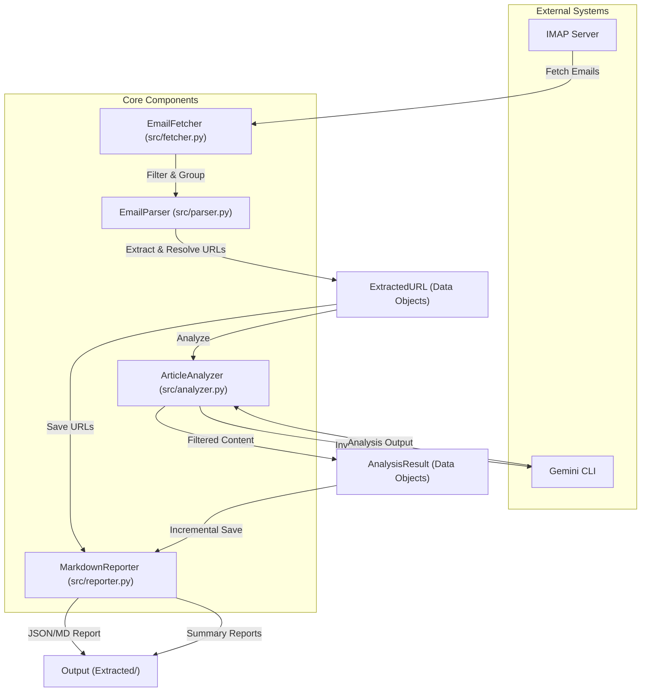

# EmailExtractor System Architecture

This document describes the high-level architecture of the EmailExtractor project.

## Overview

EmailExtractor is an automated pipeline that fetches technical article digests from emails (specifically Medium), extracts article URLs, and performs deep technical analysis using the Gemini CLI.

## System Workflow

## Key Components

- **EmailFetcher**: Handles IMAP connection and filters unread emails based on sender and subject keywords.
- **EmailParser**: Extracts and resolves article URLs from email bodies (HTML or Plain Text). It includes specific logic for Medium's URL structure and tracking parameter removal.
- **ArticleAnalyzer**: Orchestrates calls to the `gemini` CLI for article content analysis. It manages timeouts, retries, and noise filtering.
- **MarkdownReporter**: Generates final reports in Markdown and JSON formats, ensuring results are saved incrementally.

## Data Flow

1.  **Configuration**: Load settings from `config.toml`.
2.  **Fetch & Filter**: Fetch unread emails from the IMAP server that match configured filters.
3.  **URL Extraction**: Parse email bodies to extract article URLs, resolving redirects and cleaning tracking parameters.
4.  **Save URLs**: Save the list of extracted URLs to both Markdown and JSON files.
5.  **Article Analysis**: For each URL, invoke the Gemini CLI with a specialized system prompt to generate a technical summary.
6.  **Incremental Reporting**: Save analysis results as they complete to prevent data loss.
